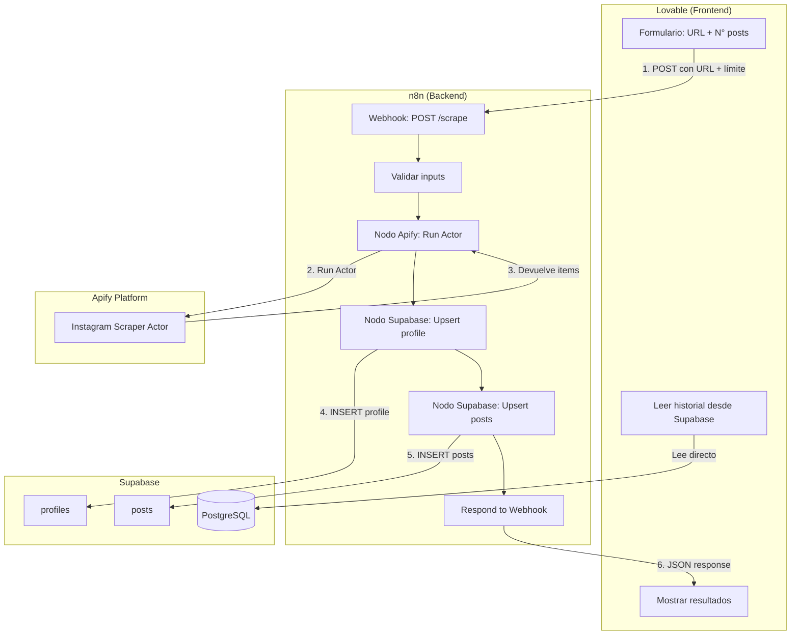
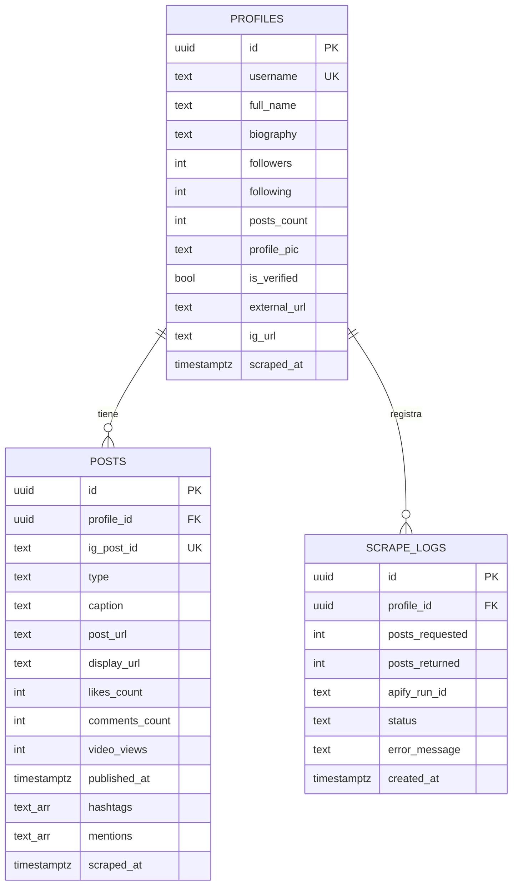
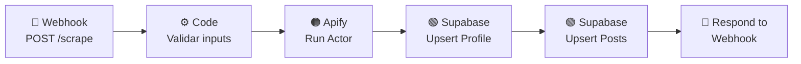

## 1. Resumen del producto

Aplicación web que permite hacer **scraping de perfiles de Instagram** con la siguiente división de responsabilidades:

- **Lovable** → construye el frontend (formulario, UI, visualización de datos) y se conecta directamente a **Supabase** para leer datos.
- **n8n** → recibe webhooks del frontend, ejecuta el scraping con **Apify**, guarda los resultados en **Supabase** y devuelve la respuesta a la app.

El usuario ingresa la URL de un perfil de Instagram, define cuántas publicaciones recientes quiere extraer, y la app dispara el proceso a través de n8n.

---

## 2. Problema que resuelve

- Extraer datos de perfiles y publicaciones de Instagram de forma automatizada.
- **Persistir la información** en Supabase para consultas, análisis e integraciones futuras.
- **Minimizar créditos de Lovable** — Lovable solo hace lo que mejor sabe (UI + Supabase), sin tener que lidiar con APIs externas como Apify.
- **Sin límite de timeout** — n8n corre en tu servidor y puede esperar todo lo que necesite el scraping.

---

## 3. Stack tecnológico

| Capa | Tecnología | Propósito |
| --- | --- | --- |
| **Frontend** | Lovable (React / Next.js) | UI del formulario + visualización de datos + conexión a Supabase |
| **Backend / Orquestación** | n8n (self-hosted o cloud) | Recibe webhook → ejecuta Apify → guarda en Supabase → responde |
| **Scraping** | Apify API v2 (nodo nativo en n8n) | Extracción de datos de Instagram — [docs.apify.com/api/v2](http://docs.apify.com/api/v2) |
| **Base de datos** | Supabase (PostgreSQL) | Almacenamiento persistente de perfiles y posts |
| **Hosting frontend** | Lovable (deploy integrado) | Publicación de la app |

---

## 4. Arquitectura general



---

## 5. Flujo detallado

1. **Usuario** ingresa la URL del perfil de Instagram y la cantidad de posts recientes en el formulario de **Lovable**.
2. **Lovable** hace un `POST` al **webhook de n8n** con `{ profileUrl, postsLimit }`.
3. **n8n** recibe el webhook y valida los inputs.
4. **n8n** ejecuta el **nodo de Apify** con el Actor `apify/instagram-scraper` (se puede referenciar por **Actor ID** o por formato `username~actor-name`).
5. **Apify** ejecuta el Actor y devuelve un `defaultDatasetId`. n8n obtiene los ítems del dataset vía `GET /v2/datasets/{datasetId}/items`. La respuesta viene envuelta en `{ "data": { "items": [...] } }`.
6. **n8n** ejecuta el **nodo de Supabase** para hacer upsert del perfil en la tabla `profiles`.
7. **n8n** ejecuta otro **nodo de Supabase** para hacer upsert de cada post en la tabla `posts`.
8. **n8n** responde al webhook con el JSON de los datos guardados.
9. **Lovable** recibe la respuesta y muestra los resultados (tarjeta de perfil + grid de posts).
10. Para el **historial**, Lovable lee directamente desde Supabase (sin pasar por n8n).

---

## 6. Modelo de base de datos (Supabase / PostgreSQL)

### 6.1 Tabla `profiles`

```sql
CREATE TABLE profiles (
  id            UUID DEFAULT gen_random_uuid() PRIMARY KEY,
  username      TEXT NOT NULL,
  full_name     TEXT,
  biography     TEXT,
  followers     INTEGER DEFAULT 0,
  following     INTEGER DEFAULT 0,
  posts_count   INTEGER DEFAULT 0,
  profile_pic   TEXT,
  is_verified   BOOLEAN DEFAULT FALSE,
  external_url  TEXT,
  ig_url        TEXT NOT NULL,
  scraped_at    TIMESTAMPTZ DEFAULT NOW(),
  
  UNIQUE(username)
);
```

### 6.2 Tabla `posts`

```sql
CREATE TABLE posts (
  id              UUID DEFAULT gen_random_uuid() PRIMARY KEY,
  profile_id      UUID REFERENCES profiles(id) ON DELETE CASCADE,
  ig_post_id      TEXT NOT NULL,
  type            TEXT,           -- 'Image', 'Video', 'Sidecar'
  caption         TEXT,
  post_url        TEXT,
  display_url     TEXT,
  likes_count     INTEGER DEFAULT 0,
  comments_count  INTEGER DEFAULT 0,
  video_views     INTEGER,
  published_at    TIMESTAMPTZ,
  hashtags        TEXT[],         -- Array de hashtags
  mentions        TEXT[],         -- Array de menciones
  scraped_at      TIMESTAMPTZ DEFAULT NOW(),
  
  UNIQUE(ig_post_id)
);
```

### 6.3 Tabla `scrape_logs` (opcional — auditoría)

```sql
CREATE TABLE scrape_logs (
  id            UUID DEFAULT gen_random_uuid() PRIMARY KEY,
  profile_id    UUID REFERENCES profiles(id),
  posts_requested INTEGER,
  posts_returned  INTEGER,
  apify_run_id  TEXT,
  status        TEXT DEFAULT 'success',  -- 'success', 'error', 'timeout'
  error_message TEXT,
  created_at    TIMESTAMPTZ DEFAULT NOW()
);
```

### 6.4 Índices recomendados

```sql
CREATE INDEX idx_posts_profile_id ON posts(profile_id);
CREATE INDEX idx_posts_published_at ON posts(published_at DESC);
CREATE INDEX idx_profiles_username ON profiles(username);
CREATE INDEX idx_scrape_logs_profile ON scrape_logs(profile_id);
```

### 6.5 Diagrama ER



---

## 7. Configuración de n8n (Backend)

### 7.1 Workflow completo

El workflow de n8n tiene **6 nodos** en secuencia:



### 7.2 Nodo 1 — Webhook (trigger)

- **Tipo:** Webhook
- **Método:** POST
- **Path:** `/scrape`
- **Response Mode:** `Last Node` (para que el nodo Respond to Webhook devuelva la respuesta)

La URL del webhook será algo como:

[`https://tu-n8n.com/webhook/scrape`](https://tu-n8n.com/webhook/scrape)

### 7.3 Nodo 2 — Validar inputs (Code)

```jsx
const { profileUrl, postsLimit } = $input.first().json.body;

// Validar URL
if (!profileUrl || !profileUrl.includes('instagram.com/')) {
  throw new Error('URL de Instagram inválida');
}

// Clampear límite entre 1 y 100
const limit = Math.min(Math.max(Number(postsLimit) || 10, 1), 100);

return [{
  json: {
    profileUrl,
    postsLimit: limit
  }
}];
```

### 7.4 Nodo 3 — Apify (Run Actor)

- **Tipo:** Apify (nodo nativo de n8n)
- **Actor:** `apify/instagram-scraper`
- **Input del Actor:**

```json
{
  "directUrls": [" $json.profileUrl "],
  "resultsType": "posts",
  "resultsLimit":  $json.postsLimit ,
  "searchType": "user",
  "searchLimit": 1
}
```

<aside>
📌

**Configuración del nodo Apify en n8n:**

1. Agregar credencial de Apify con tu **API Token** (se encuentra en *Integrations* de la Apify Console).
2. **Autenticación recomendada:** header `Authorization: Bearer <token>` (más seguro que query param `?token=`).
3. Seleccionar operación: **Run Actor**.
4. Actor ID: `apify/instagram-scraper` (o usar formato `username~actor-name`).
5. Activar **Wait for completion** para que n8n espere a que el Actor termine y devuelva los resultados del dataset.
</aside>

<aside>
⚠️

**Límite de ejecución síncrona:** si usas ejecución síncrona (endpoint `/run-sync`), Apify espera un máximo de **300 segundos (5 min)**. Si el scraping es grande, usa ejecución asíncrona + polling con `GET /v2/actor-runs/{runId}` y luego obtén resultados con `GET /v2/datasets/{defaultDatasetId}/items`.

</aside>

### 7.5 Nodo 4 — Supabase: Upsert Profile (Code + Supabase)

Primero un nodo **Code** para preparar el payload del perfil:

```jsx
const items = $input.all().map(i => i.json);
const first = items[0];

return [{
  json: {
    username: first.ownerUsername || '',
    full_name: first.ownerFullName || '',
    biography: first.biography || '',
    followers: first.followersCount || 0,
    following: first.followsCount || 0,
    posts_count: first.postsCount || 0,
    profile_pic: first.profilePicUrl || '',
    is_verified: first.isVerified || false,
    external_url: first.externalUrl || '',
    ig_url: first.inputUrl || first.url || '',
    scraped_at: new Date().toISOString(),
    // Pasar los items completos para el siguiente nodo
    _rawItems: items
  }
}];
```

Luego un nodo **Supabase**:

- **Operación:** Upsert
- **Tabla:** `profiles`
- **Conflict column:** `username`
- **Campos:** username, full_name, biography, followers, following, posts_count, profile_pic, is_verified, external_url, ig_url, scraped_at

### 7.6 Nodo 5 — Supabase: Upsert Posts

Nodo **Code** para preparar el array de posts:

```jsx
const profile = $('Supabase Upsert Profile').first().json;
const rawItems = $('Prepare Profile').first().json._rawItems;

return rawItems.map(post => ({
  json: {
    profile_id: profile.id,
    ig_post_id: post.id,
    type: post.type || 'Image',
    caption: post.caption || '',
    post_url: post.url || '',
    display_url: post.displayUrl || '',
    likes_count: post.likesCount || 0,
    comments_count: post.commentsCount || 0,
    video_views: post.videoViewCount || null,
    published_at: post.timestamp || null,
    hashtags: post.hashtags || [],
    mentions: post.mentions || [],
    scraped_at: new Date().toISOString()
  }
}));
```

Luego un nodo **Supabase**:

- **Operación:** Upsert
- **Tabla:** `posts`
- **Conflict column:** `ig_post_id`

### 7.7 Nodo 6 — Respond to Webhook

Nodo **Respond to Webhook**:

- **Response Code:** 200
- **Response Body:**

```json
{
  "success": true,
  "profile": " $('Supabase Upsert Profile').first().json ",
  "postsCount": " $('Supabase Upsert Posts').all().length ",
  "message": "Scraping completado y datos guardados en Supabase"
}
```

---

## 8. Qué construir en Lovable (Frontend)

### 8.1 Alcance de Lovable

Lovable solo se encarga de:

| Componente | Descripción | Conexión |
| --- | --- | --- |
| **Formulario de scraping** | Input URL + selector de cantidad de posts + botón | POST al webhook de n8n |
| **Estado de carga** | Spinner/skeleton mientras n8n procesa | Espera respuesta del webhook |
| **Tarjeta de perfil** | Muestra datos del perfil scrapeado | Datos de la respuesta del webhook |
| **Grid de posts** | Grid/tabla con imagen, caption, likes, fecha | Datos de la respuesta del webhook |
| **Historial** | Lista de perfiles scrapeados previamente | Lee directo de Supabase |
| **Manejo de errores** | Mostrar mensajes si falla el scraping | Errores del webhook |

<aside>
✅

**Lovable NO necesita saber nada de Apify.** Solo hace un POST a una URL (el webhook de n8n) y recibe un JSON de vuelta. Eso es todo.

</aside>

### 8.2 Prompt sugerido para Lovable

Para minimizar créditos, dale este prompt a Lovable:

> Crea una app con las siguientes páginas:
> 

> 
> 

> **Página principal (`/`):**
> 

> - Formulario con dos campos: "URL del perfil de Instagram" (text input) y "Cantidad de publicaciones" (number input, min 1, max 100, default 10).
> 

> - Botón "Scrape". Al hacer clic, hace un POST a una URL externa (variable de entorno `WEBHOOK_URL`) con body JSON `{ profileUrl, postsLimit }`.
> 

> - Mientras espera la respuesta, muestra un spinner con texto "Scraping en progreso..."
> 

> - Cuando recibe la respuesta, muestra una tarjeta con los datos del perfil y debajo un grid de publicaciones con imagen, caption, likes y fecha.
> 

> - Si recibe un error, muestra un toast con el mensaje.
> 

> 
> 

> **Página de historial (`/history`):**
> 

> - Lee de la tabla `profiles` de Supabase con sus `posts` relacionados.
> 

> - Muestra una lista de perfiles scrapeados ordenados por fecha, con opción de expandir para ver los posts.
> 

> 
> 

> **Conectar Supabase** para la página de historial (solo lectura).
> 

> **NO** necesita autenticación por ahora.
> 

### 8.3 Variable de entorno en Lovable

| Variable | Valor | Descripción |
| --- | --- | --- |
| `WEBHOOK_URL` | [`https://tu-n8n.com/webhook/scrape`](https://tu-n8n.com/webhook/scrape) | URL del webhook de n8n |

### 8.4 Código del POST al webhook (referencia para Lovable)

```tsx
// Lo que Lovable debe generar (o similar)
async function handleScrape(profileUrl: string, postsLimit: number) {
  const response = await fetch(process.env.WEBHOOK_URL!, {
    method: 'POST',
    headers: { 'Content-Type': 'application/json' },
    body: JSON.stringify({ profileUrl, postsLimit }),
  });

  if (!response.ok) {
    const error = await response.json();
    throw new Error(error.message || 'Error en el scraping');
  }

  return response.json();
}
```

---

## 9. Integración Supabase ↔ Lovable

Lovable tiene integración nativa con Supabase. Configurar:

1. En Lovable, ir a **Settings → Supabase**.
2. Ingresar la **Supabase URL** y **Anon Key**.
3. Lovable usa el `@supabase/supabase-js` automáticamente.

**Lovable solo necesita leer de Supabase** (para el historial). Las escrituras las hace n8n con la **Service Role Key**.

<aside>
🔒

**Lovable solo usa la `anon key` (lectura pública).** La `service_role key` solo la usa n8n para escribir. Nunca exponer la service role key en el frontend.

</aside>

---

## 9.5 Referencia rápida — Apify API v2 para este proyecto

Endpoints clave que usa este proyecto (base URL: [`https://api.apify.com/v2`](https://api.apify.com/v2)):

| Acción | Método | Endpoint | Notas |
| --- | --- | --- | --- |
| **Run Actor** | POST | `/acts/{actorId}/runs` | Devuelve `defaultDatasetId` en la respuesta. Rate limit: 400 req/s. |
| **Run Actor (sync)** | POST | `/acts/{actorId}/run-sync` | Espera hasta **300s**. Si excede, devuelve timeout. |
| **Get run status** | GET | `/actor-runs/{runId}` | Para polling en modo asíncrono. |
| **Get dataset items** | GET | `/datasets/{datasetId}/items` | Paginación con `limit` y `offset`. Respuesta: `{ data: { items: [...] } }` |

<aside>
🔒

**Autenticación:** usar `Authorization: Bearer <token>` en el header (recomendado). Alternativa: `?token=<token>` como query param, pero es menos seguro porque las URLs se guardan en logs y historial del navegador.

</aside>

<aside>
📊

**Rate limits globales de Apify:**

- **250,000 solicitudes/minuto** por usuario (autenticado) o por IP (no autenticado)
- **60 req/s** por recurso (default)
- **400 req/s** para Run Actor y Run Actor Task
- Ante `HTTP 429` → aplicar exponential backoff (los clientes oficiales JS/Python lo hacen automáticamente)
</aside>

---

## 10. Variables de entorno por servicio

| Servicio | Variable | Valor |
| --- | --- | --- |
| **Lovable** | `WEBHOOK_URL` | URL del webhook de n8n |
| **Lovable** | `SUPABASE_URL` | [`https://xxxxx.supabase.co`](https://xxxxx.supabase.co) |
| **Lovable** | `SUPABASE_ANON_KEY` | Anon key (solo lectura) |
| **n8n** | Credencial Apify | API Token de Apify |
| **n8n** | Credencial Supabase | URL + Service Role Key |

---

## 11. Seguridad y Row Level Security (RLS)

```sql
-- Activar RLS
ALTER TABLE profiles ENABLE ROW LEVEL SECURITY;
ALTER TABLE posts ENABLE ROW LEVEL SECURITY;
ALTER TABLE scrape_logs ENABLE ROW LEVEL SECURITY;

-- n8n (service_role) puede hacer todo
CREATE POLICY "Service role full access" ON profiles
  FOR ALL USING (auth.role() = 'service_role');

CREATE POLICY "Service role full access" ON posts
  FOR ALL USING (auth.role() = 'service_role');

-- Lovable (anon) solo puede leer
CREATE POLICY "Public read profiles" ON profiles
  FOR SELECT USING (true);

CREATE POLICY "Public read posts" ON posts
  FOR SELECT USING (true);
```

---

## 12. Validaciones y manejo de errores

| Escenario | Dónde se maneja | Acción |
| --- | --- | --- |
| URL no es de Instagram | n8n (nodo Code) | Throw error → webhook responde 400 |
| Límite fuera de rango | n8n (nodo Code) | Clampear entre 1 y 100 |
| Perfil privado | n8n (después de Apify) | Detectar items vacíos → responder error |
| Apify rate limit (`429`) | n8n (nodo Apify) | **Exponential backoff**: `DELAY = 500ms`, si recibe `429` → esperar entre `DELAY` y `2×DELAY`, duplicar delay, reintentar. Los clientes oficiales de Apify lo implementan automáticamente. |
| Apify `401` token inválido | n8n | Verificar que el token es válido y que el Actor no es privado sin permisos |
| Apify `404` Actor no encontrado | n8n | Verificar Actor ID o formato `username~actor-name` |
| Timeout de ejecución síncrona (>300s) | n8n | Cambiar a ejecución asíncrona + polling con `GET /actor-runs/{runId}` |
| Error de Supabase | n8n | Log del error en n8n + responder error al webhook |
| Duplicado de post/perfil | Supabase | Manejado por upsert con `onConflict` |
| Webhook de n8n no responde | Lovable | Timeout en el frontend + mensaje de error |

---

## 13. MVP — Alcance mínimo

### En Supabase

- [ ]  Crear tablas `profiles` y `posts` con los scripts SQL
- [ ]  Crear índices
- [ ]  Activar RLS y crear políticas

### En n8n

- [ ]  Crear workflow con los 6 nodos (webhook → validar → Apify → upsert profile → upsert posts → respond)
- [ ]  Configurar credenciales de Apify y Supabase
- [ ]  Probar el webhook con Postman/curl
- [ ]  Verificar que los datos se guardan correctamente en Supabase

### En Lovable

- [ ]  Crear formulario de scraping (URL + cantidad de posts)
- [ ]  Conectar el formulario al webhook de n8n
- [ ]  Mostrar estado de carga mientras n8n procesa
- [ ]  Mostrar tarjeta de perfil + grid de posts con los resultados
- [ ]  Crear página de historial que lee de Supabase
- [ ]  Manejo de errores (toast con mensajes claros)

---

## 14. Orden de desarrollo recomendado

1. **Primero: Supabase** → crear tablas y RLS (~10 min)
2. **Segundo: n8n** → crear y probar el workflow completo (~30 min)
3. **Tercero: Lovable** → crear el frontend y conectar al webhook + Supabase (~1 hora)

<aside>
💡

**Tip:** Prueba el workflow de n8n con curl antes de conectar Lovable. Así sabes que el backend funciona perfecto y si algo falla en Lovable, sabes que es solo tema de UI.

```bash
curl -X POST https://tu-n8n.com/webhook/scrape \
  -H "Content-Type: application/json" \
  -d '{"profileUrl": "https://www.instagram.com/natgeo", "postsLimit": 3}'
```

</aside>

---

## 15. Futuras mejoras (post-MVP)

- [ ]  Autenticación de usuarios con Supabase Auth
- [ ]  Dashboard con historial de scrapes por usuario
- [ ]  Scraping de múltiples perfiles en batch (n8n loop)
- [ ]  Exportar datos a CSV desde Lovable
- [ ]  Scheduling automático en n8n (re-scrape cada X días)
- [ ]  Gráficos de engagement (likes/comments trends)
- [ ]  Integración con GoHighLevel (CRM) desde n8n
- [ ]  Notificaciones por email/Slack cuando termina un scrape (se puede usar **Apify Webhooks** — `POST /webhooks` — para notificar a n8n cuando un Actor termina)
- [ ]  Rate limiting en el webhook de n8n para controlar costos
- [ ]  Migrar a ejecución asíncrona + **Apify Webhooks** para scrapes largos (evitar el límite de 300s de la ejecución síncrona)
- [ ]  Usar **Apify Schedules** (`POST /schedules`) para re-scrapes programados en vez de hacerlo desde n8n

---

## 16. Checklist de configuración rápida

### Supabase

- [ ]  Crear proyecto en [supabase.com](http://supabase.com)
- [ ]  Ejecutar los scripts SQL (sección 6)
- [ ]  Activar RLS y crear políticas (sección 11)
- [ ]  Copiar URL, anon key y service_role key

### n8n

- [ ]  Agregar credencial de Apify (API Token)
- [ ]  Agregar credencial de Supabase (URL + Service Role Key)
- [ ]  Crear el workflow (sección 7)
- [ ]  Activar el workflow y copiar la URL del webhook

### Lovable

- [ ]  Configurar variable de entorno `WEBHOOK_URL` con la URL del webhook de n8n
- [ ]  Conectar Supabase (URL + Anon Key)
- [ ]  Usar el prompt sugerido (sección 8.2) para generar la app
- [ ]  Probar el flujo completo