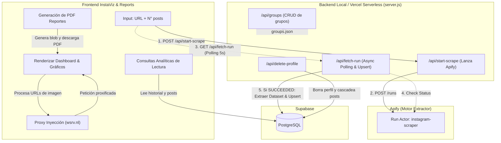

## 1. Resumen del producto

**InstaViz (Instagram Analytics Dashboard)** es una aplicación web de uso interno diseñada para agencias de marketing B2B. Su principal objetivo es la **prospección de clientes y auditoría de competidores**, permitiendo hacer scraping de perfiles de Instagram y analizar métricas de rendimiento con un diseño altamente visual.

La división de responsabilidades es la siguiente:
- **Frontend InstaViz** → Interfaz de usuario construida en HTML, CSS y Vanilla JS (con bibliotecas visuales como Plotly y html2pdf). Actúa como un CRM ligero, visualizador de datos y generador de reportes conectado a **Supabase**.
- **Backend Vercel (server.js)** → Orquesta el scraping mediante un patrón de "Async Polling", llama a la API de Apify de forma directa, procesa los resultados y los guarda en **Supabase**. También gestiona los "Grupos de Negocio" y la eliminación de datos.
- **Motor de Scraping (Apify)** → Ejecuta el Actor oficial (`apify/instagram-scraper`) para extraer data pura de perfiles comerciales.

---

## 2. Problema que resuelve (Caso de Uso Agencia B2B)

- **Auditoría Express para Prospectos:** Generación de reportes PDF profesionales listos para enviar a clientes potenciales, resumiendo el estado de su Instagram.
- **Benchmarking Competitivo:** Analizar los líderes de nicho para encontrar patrones de contenido ganador (Formatos, Frecuencia, Engagement Rate).
- **Control de Costos:** Al usar la base de datos como caché principal en Supabase, los perfiles consultados repetidamente no consumen créditos de la API de Apify.
- **Gestión Visual (CRM de Contenidos):** Clasificación de cuentas investigadas mediante "Grupos de Negocio" (Ej. 'Clientes', 'Competencia', 'Prospectos') gestionados en tiempo real.

---

## 3. Stack tecnológico

| Capa | Tecnología | Propósito |
| --- | --- | --- |
| **Frontend UI** | HTML5, CSS3, Vanilla JS, Plotly.js, html2pdf.js | Renderizado rápido, gráficos interactivos, filtros, gestión de CRM y exportación a PDF. |
| **Backend / Proxy** | Node.js (`server.js`), Express | Actúa como middleware local, gestiona el archivo `business-groups.json` y sirve como endpoint de eliminación en base de datos. Sirve localmente sobre Vercel. |
| **Integración DB (Frontend)** | `@supabase/supabase-js` (CDN) | Lectura directa del historial, perfiles y datos analíticos. |
| **Proxy de Imágenes** | `wsrv.nl` | Bypass avanzado de las restricciones CORS y expiración de CDN de Meta/Instagram para que las imágenes nunca dejen de cargar. |
| **Orquestación y Scraping** | Apify API v2 | Actor oficial: `apify/instagram-scraper`. Integrado directamente en el backend mediante Async Polling para evitar Timeouts en Vercel. |
| **Base de datos** | Supabase (PostgreSQL) | Almacenamiento relacional de `profiles` y `posts`. |

---

## 4. Arquitectura General

---

## 5. Diseño de Base de Datos (PostgreSQL en Supabase)

> [!NOTE]
> **Estado:** La base de datos, tablas, índices y RLS ya se encuentran operativas. El frontend lee con Anon Key y n8n usa Service Role Key.

### 5.1 Tabla `profiles`
Contiene la radiografía del usuario scrapeado.
- Columnas Clave: `id`, `username` (UNIQUE), `full_name`, `biography`, `followers`, `following`, `is_verified`, `profile_pic`, `external_url`, `ig_url`, `scraped_at`.

### 5.2 Tabla `posts`
Contiene el detalle granular de las publicaciones vinculadas a cada perfil.
- Relación: `profile_username` apunta a `profiles.username` con `ON DELETE CASCADE`.
- Columnas Clave: `id`, `ig_post_id` (UNIQUE), `type` (Image/Video/Sidecar), `caption`, `likes_count`, `comments_count`, `video_views`, `media_url` (o display_url), `thumbnail_url`, `published_at`, `scraped_at`.

---

## 6. Lógica de Endpoints en Servidor (`server.js`)

Se ha implementado un servidor Node.js que maneja el almacenamiento persistente local y peticiones de eliminación seguras. Está optimizado para funcionar sin problemas en entornos Serverless como Vercel y locales.

### 6.1 Gestión de Grupos de Negocio
- **Endpoints:** `GET /api/groups`, `POST /api/groups`, `PUT /api/groups/:id`, `DELETE /api/groups/:id`
- **Función:** Almacena localmente las categorías de CRM (`business-groups.json`), permitiendo colores personalizados y etiquetado masivo.

### 6.2 Eliminación de Perfiles
- **Endpoint:** `DELETE /api/delete-profile`
- **Función:** Elimina el rastreo total de una cuenta auditada desde Supabase usando el Service Role Key. Elimina automáticamente de forma segura todos sus posts en base a la restricción en cascada.

### 6.3 Orquestación de Scraping (Async Polling)
Para evitar los límites de tiempo de ejecución de las Serverless Functions (ej. Vercel corta peticiones largas a los 10 o 60 segundos), se implementa un patrón de "Async Polling" en dos fases:
- **Fase 1 (`POST /api/start-scrape`):** El frontend solicita el scraping. El backend llama a Apify para iniciar una "Run" y devuelve inmediatamente el `runId` al frontend (toma < 2s).
- **Fase 2 (`GET /api/fetch-run`):** El frontend realiza un *polling* cada 5 segundos pidiendo el estado de la "Run". El backend consulta a Apify. Si sigue corriendo, devuelve `{ pending: true }`. Si terminó con éxito (`SUCCEEDED`), el backend extrae el Dataset limpio, detecta el formato de salida, procesa los datos y realiza un "Upsert" a Supabase.

## 7. Funcionalidades del Frontend (InstaViz)

La interfaz se divide en 3 módulos principales:

| Módulo | Funcionalidad Core |
| --- | --- |
| **1. Dashboard (`index.html`)** | - Input dual (Usuario + Cantidad de Posts max 100). - KPIs de alto nivel (Total Likes, Posts, Media de Seguidores). - Cuadrícula de últimos posts analizados integrando el `wsrv.nl` proxy cache para evitar imágenes rotas. - Gráficos principales con Plotly. |
| **2. CRM Historial (`history.html`)** | - Tabla interactiva que centraliza todos los perfiles scrapeados. - Selector de "Grupos de Negocio" como etiquetas (píldoras de colores). - Botón rápido de reporte para saltar a la vista detallada. - Integración fluida del borrado asíncrono. |
| **3. Generador de Pdfs (`report.html`)** | - Recibe por querystring `?username=xxx`. - Pinta una hoja estilo A4 con la radiografía del perfil, sus "Top 3 Posts" y gráficos dedicados. - Invoca el motor `html2pdf.js` para previsualizar y desencadenar descarga PDF de reporte de auditoría completo. |

---

## 8. Soluciones Técnicas Clave Implementadas

### A. Proxy Dinámico de Imágenes (Evitar 403 Forbidden)
Las URLs de imágenes de Instagram caducan y bloquean CORS. El Frontend re-procesa dinámicamente cada URL de imagen interceptando `app.js` y `report.js` a través del servicio proxy público `wsrv.nl`. Si este falla, implementa un fallback a un SVG visual ("Image Unavailable") para garantizar que la UI nunca se vea rota.

### B. Scraping Serverless mediante Async Polling
Se descartó el uso de herramientas externas de orquestación (como n8n) por una solución en código (Express/Vercel) basada en "Async Polling". Esto resuelve nativamente las limitaciones de "Gateway Timeouts" (504) de las plataformas Serverless cuando los scrapings toman minutos en completarse. El Frontend gestiona el estado visual realizando consultas cada 5 segundos hasta recibir la confirmación de guardado en la Base de Datos.

### C. Fallback Visual y Animación DOM
Se optimizaron todas las tarjetas visuales (posts y filas de historia) para utilizar Glassmorphism. Las interacciones de eliminación no recargan la página; ejecutan la API en silent failover ocultando mediante CSS transitions el nodo del DOM tras éxito, manteniendo la memoria baja sin re-renderizar la grilla de Plotly.

---

## 9. Variables de Entorno y Despliegue

- **Frontend Variables (en `config.js`):**
    - `SUPABASE_URL` y `SUPABASE_ANON_KEY`: Proveen acceso delegado. Si se requiere RLS (Row Level Security), la UI solo tendrá permisos de `SELECT`.
- **Backend Node.js (`server.js` | Variables Entorno de Vercel):**
    - `SUPABASE_URL` y `SUPABASE_SERVICE_ROLE_KEY`: Permisos administrativos para borrados en red y Upserts masivos provenientes de Apify.
    - `APIFY_TOKEN`: Token de autenticación para la API de Apify.
- **Despliegue:** 
    - Listo para configurarse como un proyecto estático en Vercel, ejecutando \`npm start\` con motor Node habilitado.