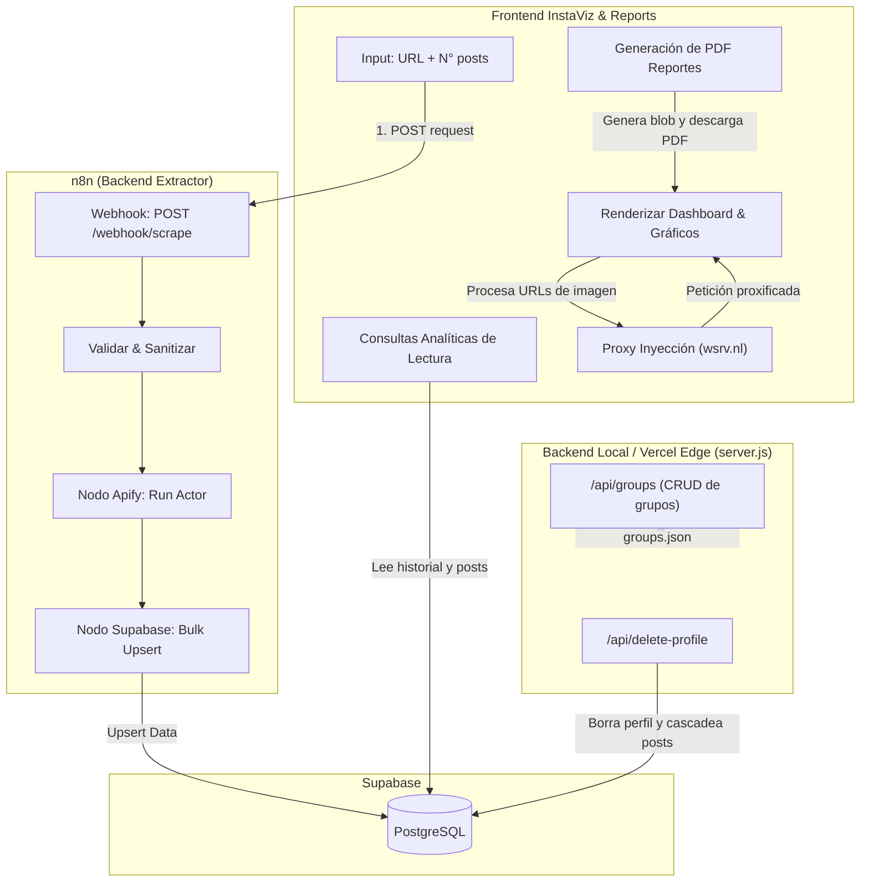

## 1. Resumen del producto

**InstaViz (Instagram Analytics Dashboard)** es una aplicación web de uso interno diseñada para agencias de marketing B2B. Su principal objetivo es la **prospección de clientes y auditoría de competidores**, permitiendo hacer scraping de perfiles de Instagram y analizar métricas de rendimiento con un diseño altamente visual.

La división de responsabilidades es la siguiente:
- **Frontend InstaViz** → Interfaz de usuario construida en HTML, CSS y Vanilla JS (con bibliotecas visuales como Plotly y html2pdf). Actúa como un CRM ligero, visualizador de datos y generador de reportes conectado a **Supabase**.
- **Orquestador (n8n)** → Recibe webhooks del frontend, ejecuta el scraping asíncrono/síncrono, guarda los resultados en **Supabase** y devuelve la confirmación.
- **Motor de Scraping (Apify)** → Ejecuta el Actor oficial (`apify/instagram-scraper`) para extraer data pura de perfiles comerciales.

---

## 2. Problema que resuelve (Caso de Uso Agencia B2B)

- **Auditoría Express para Prospectos:** Generación de reportes PDF profesionales listos para enviar a clientes potenciales, resumiendo el estado de su Instagram.
- **Benchmarking Competitivo:** Analizar los líderes de nicho para encontrar patrones de contenido ganador (Formatos, Frecuencia, Engagement Rate).
- **Control de Costos:** Al usar la base de datos como caché principal en Supabase, los perfiles consultados repetidamente no consumen créditos de la API de Apify.
- **Gestión Visual (CRM de Contenidos):** Clasificación de cuentas investigadas mediante "Grupos de Negocio" (Ej. 'Clientes', 'Competencia', 'Prospectos') gestionados en tiempo real.

---

## 3. Stack tecnológico

| Capa | Tecnología | Propósito |
| --- | --- | --- |
| **Frontend UI** | HTML5, CSS3, Vanilla JS, Plotly.js, html2pdf.js | Renderizado rápido, gráficos interactivos, filtros, gestión de CRM y exportación a PDF. |
| **Backend / Proxy** | Node.js (`server.js`), Express | Actúa como middleware local, gestiona el archivo `business-groups.json` y sirve como endpoint de eliminación en base de datos. Sirve localmente sobre Vercel. |
| **Integración DB (Frontend)** | `@supabase/supabase-js` (CDN) | Lectura directa del historial, perfiles y datos analíticos. |
| **Proxy de Imágenes** | `wsrv.nl` | Bypass avanzado de las restricciones CORS y expiración de CDN de Meta/Instagram para que las imágenes nunca dejen de cargar. |
| **Orquestación** | n8n (Webhook) | Valida schemas y realiza los upserts a base de datos protegiendo credenciales sensibles. |
| **Scraping** | Apify API v2 | Actor oficial: `apify/instagram-scraper`. |
| **Base de datos** | Supabase (PostgreSQL) | Almacenamiento relacional de `profiles` y `posts`. |

---

## 4. Arquitectura General

---

## 5. Diseño de Base de Datos (PostgreSQL en Supabase)

> [!NOTE]
> **Estado:** La base de datos, tablas, índices y RLS ya se encuentran operativas. El frontend lee con Anon Key y n8n usa Service Role Key.

### 5.1 Tabla `profiles`
Contiene la radiografía del usuario scrapeado.
- Columnas Clave: `id`, `username` (UNIQUE), `full_name`, `biography`, `followers`, `following`, `is_verified`, `profile_pic`, `external_url`, `ig_url`, `scraped_at`.

### 5.2 Tabla `posts`
Contiene el detalle granular de las publicaciones vinculadas a cada perfil.
- Relación: `profile_username` apunta a `profiles.username` con `ON DELETE CASCADE`.
- Columnas Clave: `id`, `ig_post_id` (UNIQUE), `type` (Image/Video/Sidecar), `caption`, `likes_count`, `comments_count`, `video_views`, `media_url` (o display_url), `thumbnail_url`, `published_at`, `scraped_at`.

---

## 6. Lógica de Endpoints en Servidor (`server.js`)

Se ha implementado un servidor Node.js que maneja el almacenamiento persistente local y peticiones de eliminación seguras. Está optimizado para funcionar sin problemas en entornos Serverless como Vercel y locales.

### 6.1 Gestión de Grupos de Negocio
- **Endpoints:** `GET /api/groups`, `POST /api/groups`, `PUT /api/groups/:id`, `DELETE /api/groups/:id`
- **Función:** Almacena localmente las categorías de CRM (`business-groups.json`), permitiendo colores personalizados y etiquetado masivo.

### 6.2 Eliminación de Perfiles
- **Endpoint:** `DELETE /api/delete-profile`
- **Función:** Elimina el rastreo total de una cuenta auditada desde Supabase usando el Service Role Key. Elimina automáticamente de forma segura todos sus posts en base a la restricción en cascada.

---

## 7. Funcionalidades del Frontend (InstaViz)

La interfaz se divide en 3 módulos principales:

| Módulo | Funcionalidad Core |
| --- | --- |
| **1. Dashboard (`index.html`)** | - Input dual (Usuario + Cantidad de Posts max 100). - KPIs de alto nivel (Total Likes, Posts, Media de Seguidores). - Cuadrícula de últimos posts analizados integrando el `wsrv.nl` proxy cache para evitar imágenes rotas. - Gráficos principales con Plotly. |
| **2. CRM Historial (`history.html`)** | - Tabla interactiva que centraliza todos los perfiles scrapeados. - Selector de "Grupos de Negocio" como etiquetas (píldoras de colores). - Botón rápido de reporte para saltar a la vista detallada. - Integración fluida del borrado asíncrono. |
| **3. Generador de Pdfs (`report.html`)** | - Recibe por querystring `?username=xxx`. - Pinta una hoja estilo A4 con la radiografía del perfil, sus "Top 3 Posts" y gráficos dedicados. - Invoca el motor `html2pdf.js` para previsualizar y desencadenar descarga PDF de reporte de auditoría completo. |

---

## 8. Soluciones Técnicas Clave Implementadas

### A. Proxy Dinámico de Imágenes (Evitar 403 Forbidden)
Las URLs de imágenes de Instagram caducan y bloquean CORS. El Frontend re-procesa dinámicamente cada URL de imagen interceptando `app.js` y `report.js` a través del servicio proxy público `wsrv.nl`. Si este falla, implementa un fallback a un SVG visual ("Image Unavailable") para garantizar que la UI nunca se vea rota.

### B. Bulk Upsert Híbrido en n8n
El flujo de n8n maneja dos "ramas" condicionales usando el nodo Switch:
- Actualización de perfil (`Format A` en Apify).
- Inserción y actualización masiva de posts (`Format B` en Apify).

### C. Fallback Visual y Animación DOM
Se optimizaron todas las tarjetas visuales (posts y filas de historia) para utilizar Glassmorphism. Las interacciones de eliminación no recargan la página; ejecutan la API en silent failover ocultando mediante CSS transitions el nodo del DOM tras éxito, manteniendo la memoria baja sin re-renderizar la grilla de Plotly.

---

## 9. Variables de Entorno y Despliegue

- **Frontend Variables (en `config.js`):**
    - `SUPABASE_URL` y `SUPABASE_ANON_KEY`: Proveen acceso delegado. Si se requiere RLS (Row Level Security), la UI solo tendrá permisos de `SELECT`.
    - `WEBHOOK_URL`: Apuntando a n8n para gatillar scraping en caliente.
- **Backend Node.js (`server.js` | `.env`):**
    - `SUPABASE_URL` y `SUPABASE_SERVICE_ROLE_KEY`: Permisos administrativos para borrados en red.
- **Despliegue:** 
    - Listo para configurarse como un proyecto estático en Vercel, ejecutando \`npm start\` con motor Node habilitado.