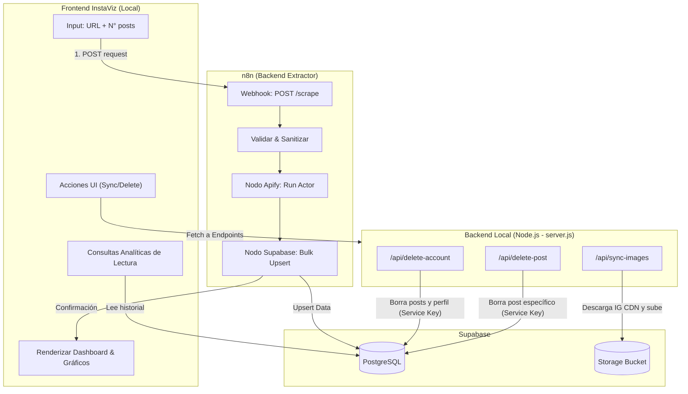

## 1. Resumen del producto

**InstaViz (Instagram Analytics Dashboard)** es una aplicación web de uso interno diseñada para agencias de marketing B2B. Su principal objetivo es la **prospección de clientes y auditoría de competidores**, permitiendo hacer scraping de perfiles de Instagram y analizar métricas de rendimiento con un diseño altamente visual.

La división de responsabilidades es la siguiente:
- **Frontend InstaViz (Local / Antigravity)** → Interfaz de usuario construida en HTML, CSS y Vanilla JS (con bibliotecas visuales como Plotly). Actúa como un CRM ligero y visualizador de datos directamente conectado a **Supabase**.
- **Orquestador (n8n)** → Recibe webhooks del frontend, ejecuta el scraping asíncrono/síncrono, guarda los resultados en **Supabase** y devuelve la confirmación.
- **Motor de Scraping (Apify)** → Ejecuta el Actor oficial para extraer data pura de perfiles comerciales.

---

## 2. Problema que resuelve (Caso de Uso Agencia B2B)

- **Auditoría Express para Prospectos:** Generar reportes visuales del estado del Instagram de un cliente potencial en segundos para respaldar propuestas comerciales.
- **Benchmarking Competitivo:** Analizar los líderes de nicho para encontrar patrones de contenido ganador (Formatos, Frecuencia, Engagement Rate).
- **Control de Costos:** Al usar caché dinámico en Supabase, los perfiles consultados repetidamente en 24 horas no consumen créditos de la API de Apify.
- **Gestión Visual (CRM de Contenidos):** Etiquetar cuentas investigadas mediante "Grupos de Negocio" (Ej. 'Clientes', 'Competencia', 'Prospectos') para seguimientos ágiles.

---

## 3. Stack tecnológico

| Capa | Tecnología | Propósito |
| --- | --- | --- |
| **Frontend UI** | HTML5, CSS3, Vanilla JS, Plotly.js | Renderizado rápido, gráficos interactivos, filtros y gestión de CRM. |
| **Backend Local** | Node.js (`server.js`) | Actúa como middleware local para operaciones bloqueadas por CORS, descargas de imágenes y operaciones sensibles en DB. |
| **Integración DB (Frontend)** | `@supabase/supabase-js` (CDN) | Lectura directa en tiempo real del historial y datos analíticos. |
| **Integración DB (Backend)** | `@supabase/supabase-js` (Node) | Uso de `SERVICE_ROLE_KEY` para operaciones privilegiadas (Borrado en cascada, subida a Storage). |
| **Orquestación** | n8n (Webhook) | Valida schemas y realiza los upserts a base de datos protegiendo credenciales sensibles. |
| **Scraping** | Apify API v2 | Actor oficial: `apify/instagram-scraper` |
| **Base de datos / Storage** | Supabase (PostgreSQL) | Almacenamiento relacional de `profiles`, `posts`, y Bucket `instaviz-media` para imágenes. |

---

## 4. Arquitectura General

---

## 5. Diseño de Base de Datos (PostgreSQL)

> [!NOTE]
> **Estado:** La base de datos, tablas, índices y políticas de RLS ya se encuentran operativas en Supabase. El frontend lee directamente de ellas.

### 5.1 Tabla `profiles`
Contiene la radiografía del usuario scrapeado.
- Restricciones: `followers >= 0`, `following >= 0`, `CHECK (ig_url ~ '^https?://')`.
- Columnas Clave: `username` (UNIQUE), `full_name`, `biography`, `followers`, `is_verified`, `profile_pic`.

### 5.2 Tabla `posts`
Contiene el detalle granular de las publicaciones para analizar engagement.
- Restricciones: Borrado en cascada `ON DELETE CASCADE` si un perfil se elimina.
- Validaciones: `type IN ('Image', 'Video', 'Sidecar')`.
- Columnas Clave: `ig_post_id` (UNIQUE), `caption`, `likes_count`, `comments_count`, `video_views`, `hashtags` (Array), `published_at`.

---

## 6. Lógica de Endpoints en Servidor Local (`server.js`)

Se ha implementado un servidor Node.js que maneja rutas API utilizando la política de máxima prevención de errores con `SERVICE_ROLE_KEY`.

### 6.1 Sincronizador de Imágenes
- **Endpoint:** `POST /api/sync-images?username=xxx`
- **Función:** Soluciona el problema de las imágenes de Instagram que expiran. 
- **Flujo:** Descarga la imagen en ArrayBuffer desde el CDN inestable, la sube al bucket público `instaviz-media` con `upsert: true` (para no duplicar), y actualiza el campo de la base de datos con la nueva URL permalink. Tiene control de concurrencia (`activeSyncs`) para evitar dobles peticiones.
- **Feedback:** Integrado con el endpoint de estado `GET /api/sync-status` para visualización de progreso real en el frontend mediante *polling*.

### 6.2 Gestión y Limpieza de Historial
- **Endpoint 1:** `DELETE /api/delete-account`
  - **Función:** Elimina el rastreo total de una cuenta auditada. Para evitar rupturas de Claves Foráneas (FK), ejecuta primero el borrado de todos los Posts vinculados y luego elimina el Profile de la DB.
- **Endpoint 2:** `DELETE /api/delete-post`
  - **Función:** Elimina publicaciones aisladas de un perfil específico (limpieza granular de outliers).

---

## 7. Funcionalidades del Frontend (InstaViz)

La interfaz se divide en múltiples módulos orientados al análisis técnico de la cuenta.

| Módulo | Funcionalidad para la Agencia |
| --- | --- |
| **Inicio (Dashboard)** | KPIs de alto nivel (Total Likes, Posts). Formulario modal para Scraping de n8n. |
| **Historial (CRM)** | Tabla interactiva que centraliza todos los perfiles (`history.html`).  👉 **Nuevas integraciones:** 1. Botón de **"💽 Guardar Fotos"** para disparar sincronizador de Supabase Storage. 2. Botones de borrado para cada cuenta y para cada publicación específica, vinculados a modales de confirmación JS y eliminación estática por DOM (sin refrescar página). |
| **Proposal Generator** | Vista `report.html`. Dedicada a condensar las analíticas de un perfil y compilar visualmente los gráficos para ser volcados a un archivo PDF (vía `html2pdf.js`) entregable y firmado. |
| **Engajamento & Timelines** | Gráficos Scatter Plot y Líneas en el Historial para estudiar tendencias históricas de likes y detectar Viral Outliers. |

---

## 8. Funciones Clave a Implementar (Roadmap de Prospección)

Para potenciar InstaViz como herramienta de cierre de ventas, se prioriza el siguiente desarrollo:

### 1. Sistema de Calificación de Perfil (Profile Health Score)
- **Concepto:** Pasar los datos del perfil (bio, hashtags, ratio de engagement) por una lógica automatizada que devuelva una nota entre 0 y 100 y detecte errores críticos.
- **Accionable de Venta:** *"Tu biografía no tiene enlace de captura y tu ratio de engagement es del 0.5%. Nuestra agencia puede subir ese Score a 80/100."*

### 2. "Competitor Duel" (Comparativa Cara a Cara)
- **Concepto:** Una vista que reciba el ID de 2 perfiles de Supabase y genere gráficos emparejados (Bar Charts) comparando quién gana en volumen, alcance y eficacia de hashtags.
- **Accionable de Venta:** Demostrar estadísticamente por qué el competidor del prospecto se está llevando la cuota de mercado.

### 3. Generador de Propuesta PDF (Exportación "Proposal-Ready")
- **Concepto:** Incorporar una librería Frontend (ej. `html2pdf.js` o API remota externa) que tome los gráficos de InstaViz, les añada el logo de tu agencia, y genere un PDF de auditoría elegante de una sola página.
- **Accionable de Venta:** Envío de correos en frío masivos adjuntando la auditoría personalizada generada automáticamente tras hacer el scraping.

---

## 9. Seguridad, Despliegue y Variables de Entorno

### Entorno Frontend (InstaViz local):
El frontend requiere acceso a la Base de datos mediante la Clave Pública de Supabase (Anon Key).
- **Variables Críticas (en `config.js`):**
    - `SUPABASE_URL` y `SUPABASE_ANON_KEY`: Proveen acceso delegado. Si se requiere RLS (Row Level Security), la UI solo tendrá permisos de `SELECT`.
    - `WEBHOOK_URL`: Apuntando a n8n para gatillar scraping en caliente.

### Backend Node.js (`server.js`)
Para ejecutar tareas bloqueadas por RLS o prohibidas por seguridad web, se debe cargar desde las variables de un archivo `.env`:
- `SUPABASE_URL` y `SUPABASE_SERVICE_ROLE_KEY`: Proveen acceso total como administrador. Este servidor ejecuta las lógicas de guardado de imágenes en Buckets y las ejecuciones duras de `DELETE FROM DB`.

### Interfaz UI Modales y Manejo de DOM
- Se ha estructurado la UI del CRM (History) para ejecutar operaciones crudas sin afectar la fluidez:
  - Funciones como `confirmDeleteAccount()` inyectan un Modal z-index alto.
  - Tras invocar el fetch AJAX (DELETE), la función `executeDelete()` atrapa el nodo padre del HTML de dicha tarjeta (`btn.closest('.profile-item')`) o de la foto específica (`btn.closest('.post-card')`) y le aplica una animación descendente (`opacity: 0`). Segundos después la remueve del DOM; eliminando la necesidad de una petición pesada para recargar toda la tabla de Supabase y manteniendo la RAM limpia y fluida.